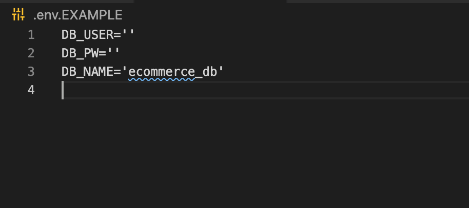

# e-commerce-back-end

## **Description**  
-------------
This application is the back end for an e-commerce site. The application was made using Sequelize, MySQL, and Express.js. A user would be able to implement this for their e-commerce business. The client's users would be able to look up, edit and delete items from a site with the help of the back end server application.

 ## **How to Use**
 ---------------
- The user would start by cloning the repository to their local computer.

- The user would need to first install the dependencies for the application with the command ```npm i```.
  
-The user would need to complete a .env file with their password, username, and database name. The .env.EXAMPLE can be used to enter the correct information. This will protect the client's private information. 



- Then the schema would be run with MySQL to start the database.


-The user would seed the database with the command: ```npm run seed```.

- The user would start the application by entering the command:  ```node server.js```. This would start the application at http://localhost:3001/ and the routes would be established to test user input. 
  
  

- The routes can be tested with Insomnia to see how the established routes would respond with user input.
- 
 

- The walkthrough video below would demonstrate the whole process.
  
  - [Walk-through Video](https://drive.google.com/file/d/1Z7PnIcF_9y7IgPAovasUtQFx0IKVa4b1/view)

## **Built With**
---------------
- 
- 
- 
- 

## **Contributors**
--------------------
  [](https://forthebadge.com)

- Rudy S. [GitHub](https://github.com/Rudys212)

## **License**
--------------------
MIT License

Copyright (c) 2021 Rudys212

Permission is hereby granted, free of charge, to any person obtaining a copy
of this software and associated documentation files (the "Software"), to deal
in the Software without restriction, including without limitation the rights
to use, copy, modify, merge, publish, distribute, sublicense, and/or sell
copies of the Software, and to permit persons to whom the Software is
furnished to do so, subject to the following conditions:

The above copyright notice and this permission notice shall be included in all
copies or substantial portions of the Software.

THE SOFTWARE IS PROVIDED "AS IS", WITHOUT WARRANTY OF ANY KIND, EXPRESS OR
IMPLIED, INCLUDING BUT NOT LIMITED TO THE WARRANTIES OF MERCHANTABILITY,
FITNESS FOR A PARTICULAR PURPOSE AND NONINFRINGEMENT. IN NO EVENT SHALL THE
AUTHORS OR COPYRIGHT HOLDERS BE LIABLE FOR ANY CLAIM, DAMAGES OR OTHER
LIABILITY, WHETHER IN AN ACTION OF CONTRACT, TORT OR OTHERWISE, ARISING FROM,
OUT OF OR IN CONNECTION WITH THE SOFTWARE OR THE USE OR OTHER DEALINGS IN THE
SOFTWARE.

## **Links** 
---------------
- [GitHub Repo](https://github.com/Rudys212/e-commerce-back-end)

- [Walk-through Video](https://drive.google.com/file/d/1Z7PnIcF_9y7IgPAovasUtQFx0IKVa4b1/view)